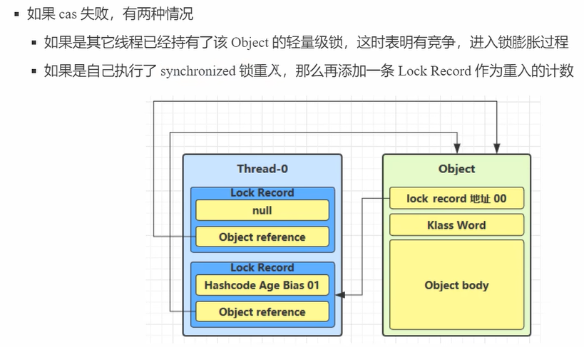
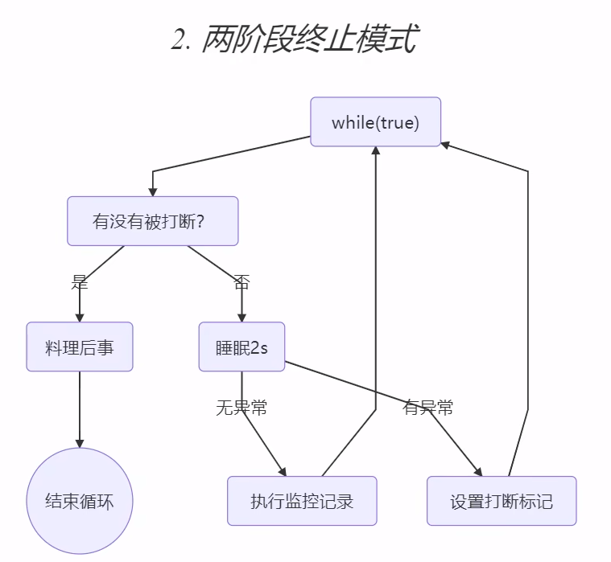

#### 并发和并行

- 并发：一个CPU ”同时“ 处理多个线程任务（宏观并行，微观串行）
- 并行：多个CPU同时处理多个线程任务

#### Java线程、进程分析工具

- jps：查看所有Java进程
- jstack：查看某个Java进程的线程信息
- jconsole：图形化方式查看Java进程的线程运行情况

#### 线程状态

- 操作系统层面5种:新建 就绪 阻塞 运行 死亡
- Java层面6种:参考Thread.State枚举

#### 线程上下文切换时机

上下文切换时，会保存当前线程运行状态（程序计数器，线程私有）
所以线程数不是越多越好，线程数 > CPU数，就会导致CPU在众多线程中频繁上下文切换，影响性能！

- CPU时间片用完
- 垃圾回收
- 更高优先级线程需要执行
- 线程调用sleep、yield、wait、join、park等方法

#### Monitor管程

- 对象头：
    - 普通对象组成：Mark Word（例如：哈希值、分代年龄、偏向锁、加锁状态等） + Klass Word（指针，指向Class类对象）
    - 数组对象组成：Mark Word + Klass Word + 数组长度
- Monitor：
    - 概念：每个Java对象可以关联一个Monitor对象，如果使用synchronized加锁，该对象头Mark Word指向Monitor（操作系统提供Monitor）
    - 组成：
        - WaitSet：
        - EntryList：没有获取到锁，等待阻塞的线程
        - Owner：获取到锁的线程
- Monitor字节码分析：
    - monitorenter：mark word设置为monitor指针
    - monitorexit：mark word重置，唤醒EntryList
      

#### Synchronized锁升级

Java 6之后的优化（整个过程透明）：

- 轻量级锁：多线程枪锁，时间是错开的，没有竞争关系，就是轻量级锁
  
  
  
- 重量级锁：有竞争，轻量级锁——>重量级锁
  
- 重量级锁-自旋优化
  
  
- 偏向锁：轻量级锁没有竞争场景，就是偏向锁
  

#### 设计模式

- 两阶段终止模式
  

#### 总结

- 1核CPU在某一时刻只能执行一个Java线程
- 多核CPU在多线程场景可以提升效率;单核CPU在多线程场景不能提高效率(上下文切换)，效率更低
- IO操作不占用CPU。但是类似拷贝文件操作（阻塞IO）需要等待IO完成，虽然不使用CPU，所以后续有非阻塞IO、异步IO进行优化
- main方法启动时就会有一个【主线程】
- 启动线程本终都要通过Thread的start方法
- 1核CPU一般针对1个Java线程，所以八核就最多同时开启运行8个线程？别忘了并发的概念，一个CPU可以同时处理多个线程任务。
- sleep方法不会释放synchronized锁
- 线程安全性分析：
    - 成员变量/静态变量并发读写需要考虑线程安全问题
    - 局部变量是线程安全（局部变量本身就在栈帧局部变量中，栈帧还在栈中，栈还是线程私有，所以当然线程安全了）
    - 局部变量【引用】不一定线程安全
        - 对象没有逃离方法作用范围，是安全的
        - 逃离了方法作用范围（使用return），那就不一定了